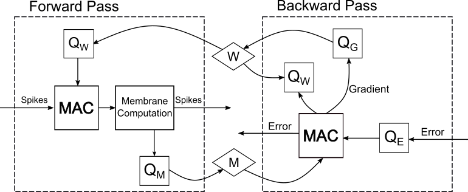
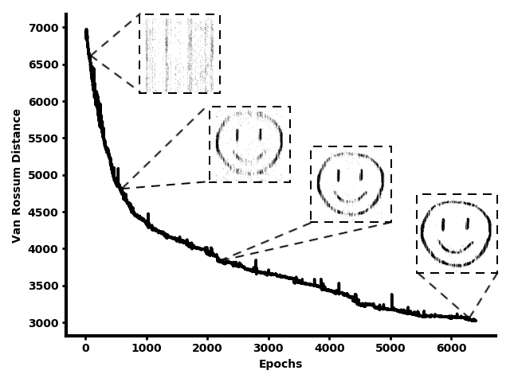
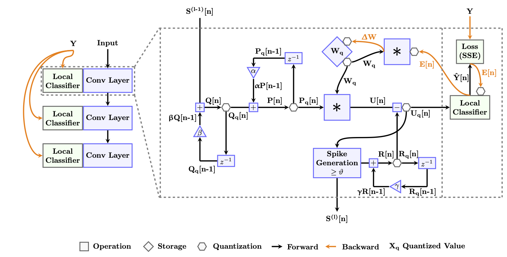
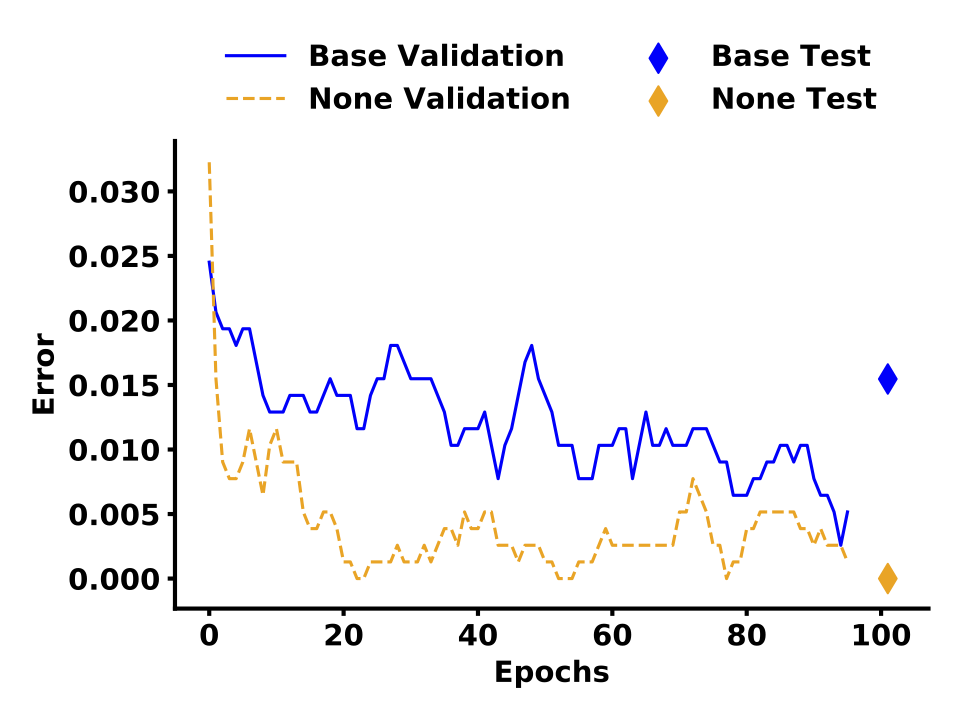
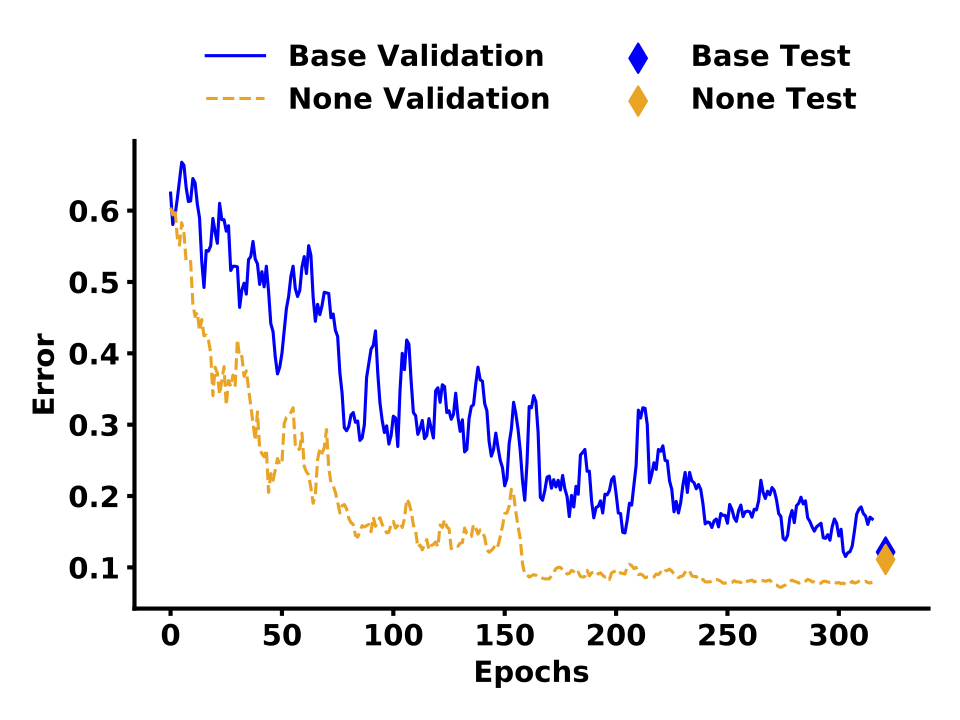

# Quantized Spiking Neural Networks

This repository contains the models and training scripts used in the papers: ["Quantizing Spiking Neural Networks with Integers"](https://dl.acm.org/doi/abs/10.1145/3407197.3407203) (ICONS 2020) and ["Memory Organization for Energy-Efficient Learning and Inference in Digital Neuromorphic Accelerators"](https://ieeexplore.ieee.org/document/9180443) (ISCAS 2020).

## Requiremnts

- Python
- PyTorch
- torchvision
- NumPy
- pickle
- argparse


## Quantized SNNs for Spatio-Temporal Patterns



All relevant code for the experiments from the ISCAS paper is contained in qsnn_precise.py, quantization.py and qsnn_util.py. To run the experiments execute:

```
python qsnn_precise.py
```



You can specify desired setting either as command-line arguments or within qsnn_precise.py.

Optional arguments:

| Argument               |  Description                                             | 
|:-----------------------|:---------------------------------------------------------|
| --input INPUT          | Input pickle file (default: ./data/input_700_250_25.pkl) |
| --target TARGET        | Target pattern pickle (default: ./data/smile95.pkl)      |
| --global_wb GLOBAL_WB  | Weight bitwidth (default: 2)                             |
| --global_ab GLOBAL_AB  | Membrane potential, synapse state bitwidth (default: 8)  |
| --global_gb GLOBAL_GB  | Gradient bitwidth (default: 8)                           |
| --global_eb GLOBAL_EB  | Error bitwidth (default: 8)                              |
| --global_rb GLOBAL_RB  | Gradient RNG bitwidth (default: 16)                      |
| --time_step TIME_STEP  | Simulation time step size (default: 0.001)               |
| --nb_steps NB_STEPS    | Simulation steps (default: 250)                          |
| --nb_epochs NB_EPOCHS  | Simulation steps (default: 10000)                        |
| --tau_mem TAU_MEM      | Time constant for membrane potential (default: 0.01)     |
| --tau_syn TAU_SYN      | Time constant for synapse (default: 0.005)               |
| --tau_vr TAU_VR        | Time constant for Van Rossum distance (default: 0.005)   |
| --alpha ALPHA          | Time constant for synapse (default: 0.75)                |
| --beta BETA            | Time constant for Van Rossum distance (default: 0.875)   |
| --nb_inputs NB_INPUTS  | Spatial input dimensions (default: 700)                  |
| --nb_hidden NB_HIDDEN  | Spatial hidden dimensions (default: 400)                 |
| --nb_outputs NB_OUTPUTS| Spatial output dimensions (default: 250)                 |


## Quantized SNNs for Gesture Detection with Local Learning


Download and extract the [DVS Slow Poker](http://www2.imse-cnm.csic.es/caviar/SLOWPOKERDVS.html#:~:text=The%20SLOW%2DPOKER%2DDVS%20database,diamond%2C%20heart%20or%20spade) and [DVS Gesture](https://www.research.ibm.com/dvsgesture/) data set.

To prepare the data run the following commands in the respective directories (e.g. in the directory of the DVS Poker data or the DVS Gesture data).

```
python prepPoker.py
```

```
python prepGesture.py
```


All relevant code for the experiments from the ICONS paper is contained in qsnn_decolle.py, quantization.py and localQ.py. To run the experiments execute:

```
python qsnn_decolle.py
```

 

You can specify desired setting either as command-line arguments or within qsnn_decolle.py.

Optional arguments:

| Argument               |  Description                                             | 
|:-----------------------|:---------------------------------------------------------|
| --data-set DATA_SET  | Input date set: Poker/Gesture (default: Gesture) |
| --global_wb GLOBAL_WB     |                   Weight bitwidth (default: 8) |
| --global_qb GLOBAL_QB      |                 Synapse bitwidth (default: 10) |
| --global_pb GLOBAL_PB       |             Membrane trace bitwidth (default: 12) |
| --global_rfb GLOBAL_RFB      |                Refractory bitwidth (default: 2) |
| --global_sb GLOBAL_SB         |            Learning signal bitwidth (default: 6) |
| --global_gb GLOBAL_GB         |            Gradient bitwidth (default: 10) |
| --global_eb GLOBAL_EB          |        Error bitwidth (default: 6) |
| --global_ub GLOBAL_UB           |    Membrane Potential bitwidth (default: 6) |
| --global_ab GLOBAL_AB           |       Activation bitwidth (default: 6) |
| --global_sig GLOBAL_SIG          |           Sigmoid bitwidth (default: 6) |
| --global_rb GLOBAL_RB            |          Gradient RNG bitwidth (default: 16) |
| --global_lr GLOBAL_LR             |        Learning rate for quantized gradients (default: 1) |
| --global_lr_sgd GLOBAL_LR_SGD      |              Learning rate for SGD (default: 1e-09) |
| --global_beta GLOBAL_BETA           |        Beta for weight init (default: 1.5) |
| --delta_t DELTA_T   |  Time step in ms (default: 0.001) |
| --input_mode INPUT_MODE |                Spike processing method (default: 0) |
| --ds DS            |   Downsampling (default: 4) |
| --epochs EPOCHS    |  Epochs for training (default: 320) |
| --lr_div LR_DIV     |  Learning rate divide interval (default: 80) |
| --batch_size BATCH_SIZE               |  Batch size (default: 72) |
| --PQ_cap PQ_CAP     |  Value cap for membrane and synpase trace (default: 1) |
| --weight_mult WEIGHT_MULT  |           Weight multiplier (default: 4e-05) |
| --dropout_p DROPOUT_P       |      Dropout probability (default: 0.5) |
| --lc_ampl LC_AMPL  |   Magnitude amplifier for weight init (default: 0.5) |
| --l1 L1            |   Regularizer 1 (default: 0.001) |
| --l2 L2             |  Regularizer 2 (default: 0.001) |
| --tau_mem_lower TAU_MEM_LOWER    |                 Tau mem lower bound (default: 5) |
| --tau_mem_upper TAU_MEM_UPPER    |              Tau mem upper bound (default: 35) |
| --tau_syn_lower TAU_SYN_LOWER     |            Tau syn lower bound (default: 5) |
| --tau_syn_upper TAU_SYN_UPPER      |             Tau syn upper bound (default: 10) |
| --tau_ref TAU_REF    | Tau ref (default: 2.857142857142857) |

